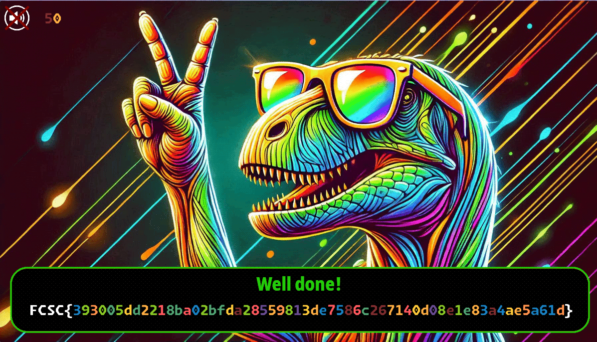

---
title = '[FCSC 2025] Coloratops'
date = '2025-04-27'
tags = ['ctf-writeup', 'reverse-engineering', 'english']
---

> [!instructions]
> 
> *Here is a crackme full of colors with an old-school vibe.*

The binary is a linux graphical program using the [SDL](https://www.libsdl.org/) library to display a graphical window. It shows a colorful screen with a timer, and prompt for a password. We can also unmute the sound with space, which plays old school synth music.

The first thing we can note is that only some characters are allowed : `'F'`, `'C'`, `'S'`, `'C'`, `'{'`, `'}'` and hexadecimal characters, which probably means the right password is the flag, and the flag is in the format `FCSC{[some hex chars]}`. Hex chars are displayed in different colors, and the colors seems to change depending on the text input.

> [!note]- Here is a `shell.nix` for my NixOS friends
> ```nix
> with import <nixpkgs> { };
> mkShell {
>    NIX_LD_LIBRARY_PATH = lib.makeLibraryPath [
>      openssl
>      SDL2
>      SDL2_ttf
>      SDL2_image
>      nix-ld
>    ];
>    NIX_LD = lib.fileContents "${stdenv.cc}/nix-support/dynamic-linker";
>  }
>  ```


## Static analysis

Let's open it in Ghidra. After renaming some symbols, we can identify different parts of the main function :

First, it initializes the SDL window, then, there is the main loop of the program, which displays each frames and detect keys press.

We can identify different keys handlers :

```c
if (event[0] == 768) {
  /* Ctrl + Backspace = clear text if text */
  if (((key == 8) && ((local_c0 & 0xc0) == 0)) && (index != 0)) {
    puVar1 = &DAT_0036b25f + index;
    index = index - 1;
    *puVar1 = 0;
  }
  else {
    /* Ctrl + Q = quit */
    if ((key == 113) && ((local_c0 & 0xc0) != 0)) {
      local_24 = 0;
    }
    else {
      /* Ctrl + C = delete text */
      if ((key == 99) && ((local_c0 & 0xc0) != 0)) {
        memset(&user_input,0,0x100);
        index = 0;
      }
      else {
        /* Ctrl + Backspace = delete text */
        if ((key == 8) && ((local_c0 & 0xc0) != 0)) {
          memset(&user_input,0,0x100);
          index = 0;
        }
        else {
          /* Esc = delete text */
          if (key == 27) {
            memset(&user_input,0,0x100);
            index = 0;
          }
          else {
            /* Space = mute/unmute */
            if (key == 0x20) {
              DAT_0036b374 = DAT_0036b374 ^ 1;
              SDL_PauseAudioDevice(DAT_0036b210,DAT_0036b374 == 0);
            }
            else {
              /* Ctrl + V = paste */
              if (((key == 0x76) && ((local_c0 & 0xc0) != 0)) &&
                 (local_60 = (char *)SDL_GetClipboardText(),
                 local_60 != (char *)0x0)) {
                local_38 = 0;
                while (sVar6 = strlen(local_60), local_38 < sVar6) {
                  if (((index < 0x40) &&
                      (pcVar5 = strchr("FCSC{}abcdef0123456789",
                                       (int)local_60[local_38]),
                      pcVar5 != (char *)0x0)) && (index < 0xff)) {
                    pcVar5 = &user_input + index;
                    index = index + 1;
                    *pcVar5 = local_60[local_38];
                    (&user_input)[index] = 0;
                  }
                  local_38 = local_38 + 1;
                }
                SDL_free(local_60);
              }
            }
          }
        }
      }
    }
  }
}
```

User input is put in a buffer. The next instructions are checking that the first characters are `FCSC{` and the last character is `}`. We can also note that the flag must be 64 characters long, which means the hexadecimal characters will be 58 characters long.
Next, another check is done with a mysterious function, but we'll talk about that later.

```c
flag_format_ok =
   (uint)(((((user_input == 'F' && DAT_0036b261 == 'C') && DAT_0036b262 == 'S') &&
		   DAT_0036b263 == 'C') && DAT_0036b264 == '{') &&
		 (&DAT_0036b25f)[index] == '}');
bVar2 = compare_pixels();
flag_format_ok = (uint)CONCAT71(extraout_var,bVar2) & flag_format_ok;
```

After skipping some SDL specific instructions like text and surfaces rendering, we reach this :

```c
if (timer_finished == 0) {
	if (flag_format_ok == 0) {
	  SDL_RenderCopy(renderer,background,0,&DAT_0010b410);
	}
	else {
	  sha256(&user_input,index,buffer_64);
	  if (DAT_0036b200 == 0) {
		decrypt_image(renderer,&DAT_0036b200,buffer_64);
	  }
	  SDL_RenderCopy(renderer,DAT_0036b200,0,&DAT_0010b410);
	}
}
```

If the input is correct (`flag_format_ok == 1`), the MD5 sum of the flag is used as a key to decrypt a texture using AES 256. The image is then displayed on the screen.

Now let's see how to get the correct flag. We can look into the mysterious function I mentionned :

```c
byte compare_pixels(void)

{
  byte bVar1;
  ulong uVar2;
  int rect;
  undefined4 local_94;
  undefined4 local_90;
  undefined4 local_8c;
  byte local_88 [68];
  int local_44;
  long pixels;
  SDL_Surface *surface;
  undefined4 local_30;
  int local_2c;
  ulong i;
  int y;
  int x;
  byte local_d;
  int j;
  
  memset(local_88,0xff,64);
  j = 0;
  while( true ) {
    if (63 < j) {
      bVar1 = 1;
      for (i = 0; i < 64; i = i + 1) {
        bVar1 = bVar1 & (uint)local_88[i] == *(uint *)(&color_indexes + i * 4);
      }
      return bVar1;
    }
    local_2c = j * 17 + 60;
    local_30 = 607;
                    /* Create a surface : 
                       - no flags
                       - 16 x 32
                       - depth 20 
                       - RGBA8888 format */
    surface = (SDL_Surface *)SDL_CreateRGBSurfaceWithFormat(0,16,32,0x20,0x16462004);
    if (surface == (SDL_Surface *)0x0) break;
    rect = local_2c;
    local_94 = local_30;
    local_90 = 16;
    local_8c = 32;
    SDL_RenderReadPixels(renderer,&rect,*surface->format,surface->pixels,surface->pitch);
    pixels = surface->pixels;
    local_d = 255;
    for (x = 0; x < 32; x = x + 1) {
      for (y = 0; y < 16; y = y + 1) {
        local_44 = *(int *)(pixels + (long)(y + x * 16) * 4);
        if (local_d == 255) {
          uVar2 = color_index(local_44);
          local_d = (byte)uVar2;
        }
      }
    }
    local_88[j] = local_d;
    SDL_FreeSurface(surface);
    j = j + 1;
  }
  return 0;
}

```

I didn't take a lot of time to rename all symbols and clean the code, but it is quite simple :

- it loops 64 times, and inside the loop :
  - it creates a 16 x 32 texture, and place it on each letters positions in the window (`local_2c` is x and `local_30` is y)
  - it reads the pixels behind these textures in the screen
  - it calls `color_index` with the color of the first pixel in the square and save the return value in an array
- at the end of the loop, it compares the saved values to a list of indexes in memory

Here is `color_index` :

```c
ulong color_index(int color)

{
  ulong i;
  
  i = 0;
  while( true ) {
    if (9 < i) {
      return 0xffffffff;
    }
    if (color == *(int *)(&colors + i * 4)) break;
    i = i + 1;
  }
  return i;
}
```

This function takes a list of 10 colors in the binary's memory, and returns the index in this list of the color passed as a parameter.

From all of this, we can deduce that the input letters must have a specific color sequence to pass the tests in `compare_pixels`.

## Solving

Let's create a simple python script to get this color sequence :

```python
colors_indexes = [
    0,0,0,0,0,9,6,3,6,7,6,5,7,4,6,2,7,7,2,9,6,7,7,5,1,6,2,8,4,3,6,8,5,4,9,2,9,1,2,7,1,1,4,4,2,5,4,8,6,1,6,7,4,9,1,9,5,4,3,9,9,9,3,0
]

colors = [
    (255, 255, 255, 255),
    (255, 47, 45, 128),
    (255, 94, 89, 255),
    (255, 76, 146, 255),
    (255, 67, 174, 255),
    (255, 58, 202, 255),
    (255, 38, 201, 138),
    (255, 117, 166, 82),
    (255, 147, 76, 106),
    (255, 196, 130, 25),
]

color_sequence = []


def print_colors_by_index(palette, indexes):
    for i in indexes:
        a, b, g, r = palette[i]
        # ANSI escape sequence for RGB color (background)
        print(f"\033[48;2;{r};{g};{b}m   \033[0m #{r:x}{g:x}{b:x}{a:x}")
        color_sequence.append((b, g, r, a))


print_colors_by_index(colors, colors_indexes)
```

We get this output :


Now, the remaining question is : how are the colors determined. First, my idea was to bruteforce the colors manually, but I don't like to do something without understanding how it work.

After looking at the font rendering code, I decided to extract the font. (for anyone wanting to do that, `binwalk` was not giving the correct file, so I had to open IDA, select the bytes from the start to the end of the font, and export it as raw data)

After opening the font in [fontdrop.info](https://fontdrop.info), I could see that the font is using [OpenType](https://fr.wikipedia.org/wiki/OpenType) features, more specifically, COLR and GSUB.

**GSUB** (Glyph Substitution) is used to substitute a glyph (letter) with another glyph from the font, depending on different things like the length of the text buffer, or the previous glyph.

**COLR** is used to create colored letters in the font. I think it is used in fonts with emojis, but I'm not sure.

(correct me if I'm wrong, I learned all of that while doing the challenge)

When we type random hex characters with the font, we get colored letters, and the colors change depending on the typed text.


To find the flag, I made a python script that test different hex characters, starting from the end, with a fixed length text buffer. (For the color detection from the font, I have to admit that ChatGPT helped me a lot since I hadn't time to learn about font parsing, and it is hard to find the right documentation).

```python
import uharfbuzz as hb
from fontTools.ttLib import TTFont

colors_sequence = [
    (255, 255, 255, 255),
    (255, 255, 255, 255),
    (255, 255, 255, 255),
    (255, 255, 255, 255),
    (255, 255, 255, 255),
    (196, 130, 25, 255),
    (38, 201, 138, 255),
    (76, 146, 255, 255),
    (38, 201, 138, 255),
    (117, 166, 82, 255),
    (38, 201, 138, 255),
    (58, 202, 255, 255),
    (117, 166, 82, 255),
    (67, 174, 255, 255),
    (38, 201, 138, 255),
    (94, 89, 255, 255),
    (117, 166, 82, 255),
    (117, 166, 82, 255),
    (94, 89, 255, 255),
    (196, 130, 25, 255),
    (38, 201, 138, 255),
    (117, 166, 82, 255),
    (117, 166, 82, 255),
    (58, 202, 255, 255),
    (47, 45, 128, 255),
    (38, 201, 138, 255),
    (94, 89, 255, 255),
    (147, 76, 106, 255),
    (67, 174, 255, 255),
    (76, 146, 255, 255),
    (38, 201, 138, 255),
    (147, 76, 106, 255),
    (58, 202, 255, 255),
    (67, 174, 255, 255),
    (196, 130, 25, 255),
    (94, 89, 255, 255),
    (196, 130, 25, 255),
    (47, 45, 128, 255),
    (94, 89, 255, 255),
    (117, 166, 82, 255),
    (47, 45, 128, 255),
    (47, 45, 128, 255),
    (67, 174, 255, 255),
    (67, 174, 255, 255),
    (94, 89, 255, 255),
    (58, 202, 255, 255),
    (67, 174, 255, 255),
    (147, 76, 106, 255),
    (38, 201, 138, 255),
    (47, 45, 128, 255),
    (38, 201, 138, 255),
    (117, 166, 82, 255),
    (67, 174, 255, 255),
    (196, 130, 25, 255),
    (47, 45, 128, 255),
    (196, 130, 25, 255),
    (58, 202, 255, 255),
    (67, 174, 255, 255),
    (76, 146, 255, 255),
    (196, 130, 25, 255),
    (196, 130, 25, 255),
    (196, 130, 25, 255),
    (76, 146, 255, 255),
    (255, 255, 255, 255),
]

print(len(colors_sequence))


def shape_text(font_path, text):
    # Read font bytes
    with open(font_path, "rb") as f:
        font_data = f.read()

    face = hb.Face(font_data)
    font = hb.Font(face)

    buf = hb.Buffer()
    buf.add_str(text)
    buf.guess_segment_properties()

    hb.shape(font, buf)
    glyph_infos = buf.glyph_infos
    return glyph_infos


def get_glyph_colors(font_path, glyph_infos):
    font = TTFont(font_path)
    colr = font["COLR"]
    cpal = font["CPAL"]

    gid_to_name = font.getGlyphOrder()
    result = []

    for info in glyph_infos:
        gid = info.codepoint
        glyph_name = gid_to_name[gid]

        layers = colr.ColorLayers.get(glyph_name, [])
        layer_info = []
        for layer in layers:
            color = cpal.palettes[0][layer.colorID]
            layer_info.append(
                {"layer_glyph": layer.name, "color": tuple(color)}  # (R, G, B, A)
            )
        result.append((glyph_name, layer_info))
    return result


def get_colors(text):
    glyph_infos = shape_text(font_path, text)
    colored_glyphs = get_glyph_colors(font_path, glyph_infos)
    colors = []
    for gname, layers in colored_glyphs:
        colors.append(layers[0]["color"])
    return colors


# === Usage ===

font_path = "FCSC.ttf"
hex_chars = "0123456789abcdef"
default_string = "FCSC{0000000000000000000000000000000000000000000000000000000000}"


def colors_match(candidate, index):
    colors = get_colors("".join(candidate))
    return colors[index] == colors_sequence[index]


def solve(candidate, index):
    print(f"Trying : {"".join(candidate)}")
    if index == 4:
        return candidate

    for char in hex_chars:
        candidate[index] = char
        if colors_match(candidate, index):
            result = solve(candidate, index - 1)
            if result:
                return result
    return None


solution = solve(list(default_string), 62)
if solution:
    print(f"✅ Found: {"".join(solution)}")
else:
    print("❌ No solution found.")
```

First, we get the color of each glyph with the `fonttools` python library, then we can shape the text with [harfbuzz](https://github.com/harfbuzz/harfbuzz) to get the correct glyph substitutions, and we can compare the colors to the color sequence that validate the flag.

```text
Trying : FCSC{0000000000000000000000000000000000000000000000000000000000}
Trying : FCSC{000000000000000000000000000000000000000000000000000000000d}
Trying : FCSC{000000000000000000000000000000000000000000000000000000000d}
Trying : FCSC{000000000000000000000000000000000000000000000000000000020d}
Trying : FCSC{000000000000000000000000000000000000000000000000000000420d}
Trying : FCSC{000000000000000000000000000000000000000000000000000002420d}
[...]
Trying : FCSC{000005dd2218ba02bfda28559813de7586c267140d08e1e83a4ae5a61d}
Trying : FCSC{000005dd2218ba02bfda28559813de7586c267140d08e1e83a4ae5a61d}
Trying : FCSC{000005dd2218ba02bfda28559813de7586c267140d08e1e83a4ae5a61d}
Trying : FCSC{003005dd2218ba02bfda28559813de7586c267140d08e1e83a4ae5a61d}
Trying : FCSC{093005dd2218ba02bfda28559813de7586c267140d08e1e83a4ae5a61d}
Trying : FCSC{393005dd2218ba02bfda28559813de7586c267140d08e1e83a4ae5a61d}
✅ Found: FCSC{393005dd2218ba02bfda28559813de7586c267140d08e1e83a4ae5a61d}
```

Aaaand it's the right flag !


